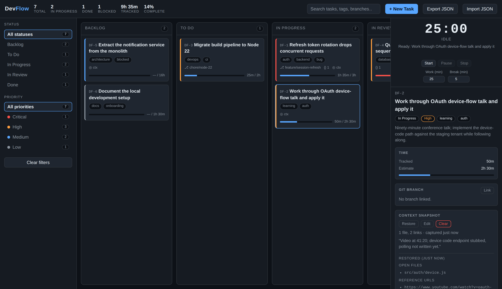

# DevFlow — a context-aware task manager for developers

A personal task manager built around one question: **what were you actually doing when you got interrupted?**

Most task tools record *what* must be done. They do not record the state you were in when
something pulled you away — which files were open, what you were reading, and the decision
you had reached but not yet written down. DevFlow records that, and hands it back when you return.

**[▶ Open the live app](https://kartiksingh016.github.io/software-eng/)**



## What it does

| Feature | Why it exists |
|---|---|
| **Context snapshots** | Save open files, reference links, notes and a "where I left off" marker before switching away. Restore them on return. |
| **Focus timer** | A configurable work/break timer that writes elapsed effort onto the task automatically. |
| **Git branch links** | Associate a task with its branch and get a commit prefix from the readable task key. |
| **Code snippets** | Keep a useful fragment attached to the task it belongs to. |
| **Kanban board** | Five states, drag-and-drop, plus full keyboard operation. |
| **Export / import** | The whole board as a JSON file. Nothing leaves your machine. |

The stopping-point marker is the part that matters. A snapshot reading
`Video at 41:20; device code endpoint stubbed, polling not written yet` costs four seconds to
write and saves replaying forty minutes of a recording you have already understood.

## Running it

Open `index.html` in a browser. That is the whole procedure — no install, no build step,
no server, no dependencies.

```bash
git clone https://github.com/KartikSingh016/software-eng.git
cd software-eng
open index.html          # or: xdg-open index.html
```

## Design

One file, 1,366 source lines, organised into five packages with a strict dependency rule:
a layer may depend on the layers beneath it and never on those above.

| Package | Responsibility | SLOC |
|---|---|---|
| 4.1 Domain Model | Entities, invariants, serialisation | 272 |
| 4.2 Task Management | The board: filtering, sorting, statistics, keys | 149 |
| 4.3 Context Management | Capture, restore, staleness | 25 |
| 4.4 Time Tracking | Sessions, countdown, effort accounting | 109 |
| 4.5 Presentation | Rendering and events — the only layer that touches the DOM | 596 |

Restricting DOM access to a single package is what lets the other four be tested without a browser.

## Tests

```bash
npm install playwright        # once
node test/verify.js
```

53 checks run against the real page in Chromium: task lifecycle, filter composition,
timer accounting, import validation, keyboard operation and output escaping.

Two of those tests exist because the code was wrong in ways inspection missed:

- **Paused time was credited as work.** Effort was derived from start and end timestamps, so
  pausing for lunch credited the whole break. Active time is now accumulated explicitly.
- **The countdown stalled in background tabs.** Browsers throttle inactive tabs to roughly one
  timer callback per minute — and a focus timer is *always* in a background tab, because you are
  looking at your editor. The countdown now derives from a wall-clock deadline and self-corrects.

Both behaved correctly under every manual test. Neither was found by inspection.

## Privacy

There is no server, no account and no network code. The source contains no `fetch`,
no `XMLHttpRequest` and no external references — a property the test suite asserts rather
than merely claims. Your notes about unfinished work stay on your machine.

The trade-off is deliberate and real: the board lives in memory and is lost on reload unless
you export it. Durability was traded for locality.

## Documentation

Full specification, architecture and evaluation: [`docs/`](docs/) — produced as a university
software engineering project (IU, DLBCSPSE01). UML sources and renders in [`diagrams/`](diagrams/).

## Licence

MIT
